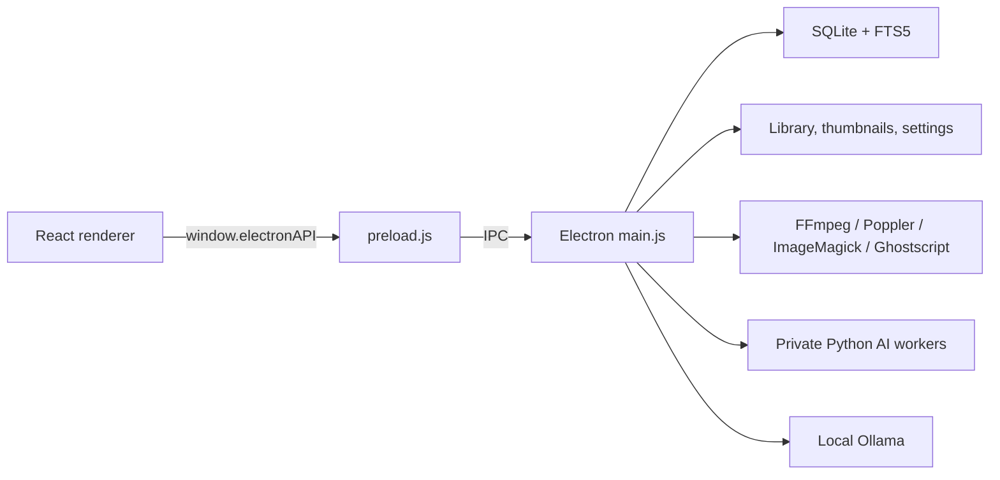
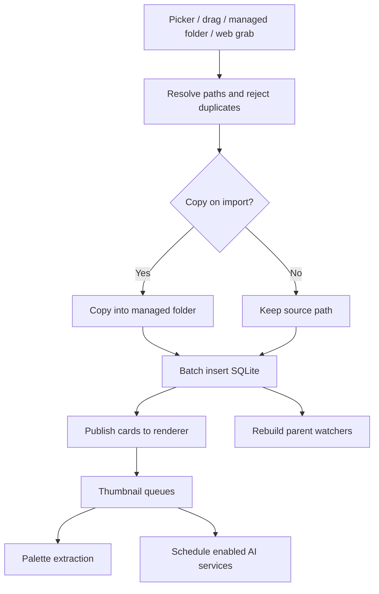

# Stag Architecture

## Process Model

Stag uses three execution layers:

1. **Electron main process** owns privileged operating-system and persistence work.
2. **Preload bridge** exposes a narrow, context-isolated API.
3. **React renderer** owns UI state, rendering, and user workflows.

Additional child processes and workers handle Python AI and Ollama image preparation.

## Entry Points

- `electron/main.js`: Electron entry configured by `package.json`.
- `electron/preload.js`: context bridge loaded into the BrowserWindow.
- `src/renderer/main.tsx`: mounts `RuntimeBootstrap`.
- `src/renderer/components/RuntimeBootstrap.tsx`: selects onboarding or `App`.
- `src/renderer/App.tsx`: initializes settings, feature status, database pages, and global listeners.

## Startup

The main process:

1. configures logging and process error handlers;
2. obtains the single-instance lock;
3. initializes runtime and AI managers;
4. creates the tray and BrowserWindow;
5. initializes SQLite after the window can paint;
6. runs schema and migration checks;
7. loads a cached first asset slice;
8. schedules bridge servers, watchers, scans, FTS, thumbnails, and AI work in delayed phases.

The renderer:

1. checks the preload `initialRuntimeReady` argument;
2. validates runtime status and onboarding state;
3. installs dependencies when required;
4. loads settings and AI feature state;
5. applies theme and appearance variables;
6. loads the cached/startup asset page;
7. hydrates folders, tags, smart folders, and full data;
8. subscribes to asset, thumbnail, runtime, and AI events.

Delayed maintenance is deliberate: opening the shell and first asset page takes priority over full-library cleanup.

## BrowserWindow Security

- `nodeIntegration: false`
- `contextIsolation: true`
- operations cross through `contextBridge`
- renderer code cannot directly require Node modules

`webSecurity` is disabled because the application displays local files and bundled viewers. Any future remote content path must account for that broader renderer capability.

## Storage

### Settings

`stag-settings.json` is stored under Electron `userData`. It contains appearance, library paths, runtime onboarding state, AI toggles, Ollama settings, copy settings, thumbnail labels, and sensitive-content settings.

### Library

The configured library directory contains:

- `library.db`: SQLite database;
- WAL and shared-memory companions while open;
- `startup-cache.json`: lightweight first-page cache;
- `thumbs/<id-prefix>/`: WebP thumbnails and preview files;
- `ai-index/`: persistent TIPSv2 and DINOv3 vectors plus compact identity metadata.

### SQLite

SQLite runs through `better-sqlite3` with:

- WAL journal mode;
- normal synchronous mode;
- foreign-key enforcement;
- prepared statements;
- explicit transactions for relation-heavy writes;
- delayed passive checkpoints and a truncate checkpoint on quit.

Tables:

| Table | Purpose |
| --- | --- |
| `assets` | Core metadata, deletion state, thumbnail flag, and AI flags. |
| `asset_tags` | Many-to-many asset tags. |
| `asset_folders` | Many-to-many folder membership. |
| `asset_colors` | Ordered extracted palette colors. |
| `asset_annotations` | Normalized image annotation points. |
| `folders` | Nested folder metadata. |
| `folder_autotags` | Tags associated with folder behavior. |
| `smart_folders` | JSON rules and `ALL`/`ANY` logic. |
| `tags` | Global tag catalog. |
| `jobs` | Import/copy progress and failure metadata. |
| `asset_fts` | FTS5 search projection. |

Every mutation that affects queries invalidates the main-process query cache and startup page. Asset relation writes rebuild the FTS row.

## Query And Cache Model

`dbQueryAssets` constructs parameterized SQL for navigation, search, filters, folders, sensitive tags, smart rules, sorting, random views, and explicit asset ID lists.

The main process caches query results by serialized options. The renderer additionally keeps at most 12 pages of 1,000 assets. Mutation events clear affected caches and reload page zero after the SQLite write commits.

`startup-cache.json` stores a lightweight first page so the renderer can paint before full SQLite hydration. Cache keys include settings that affect visibility.

## Import Pipeline

Local import sessions and copy sessions are serialized. Asset inserts are batched. Thumbnail work starts after cards are visible.

Managed-folder and WebGrab imports enter through main-process watchers. The web endpoint only saves files; the watcher is the sole importer to prevent double insertion.

## Thumbnail Pipeline

Thumbnail records are files, while SQLite stores `hasThumb` and dimensions.

Core paths:

- full: `thumbs/<prefix>/<id>.webp`;
- variants: `<id>_sm.webp`, `<id>_md.webp`, `<id>_lg.webp`;
- converted preview: `<id>_preview.png`;
- transient video frames use temporary paths or returned data.

Generation dispatches by format:

- Sharp for common raster formats;
- `.rotate()` for EXIF orientation;
- Chromium decode for browser-readable fallback formats;
- Poppler for PDF;
- EPUB archive parsing and cover extraction;
- FFmpeg for video and difficult scrub frames;
- ImageMagick/Ghostscript for design and PostScript-derived formats;
- renderer-assisted Three.js for 3D.

`reconcileMissingThumbnailFiles` prevents stale database flags. Migrations reset formats when generation support improves. Variant work is deduplicated by ID in a main-process queue.

## Preview Pipeline

Preview selection happens in `LightboxModal` by extension category.

- Browser-native sources use file URLs.
- Unsupported raster/design sources use `preview:prepare`.
- PDF uses bundled PDF.js.
- EPUB uses EPUB.js.
- TS/MTS/M2TS use a local bridge and `mpegts.js`.
- Other video uses the HTML video element.
- 3D uses Three.js and format loaders.
- text reads a bounded UTF-8 buffer;
- fonts use `FontFace`.

## Runtime Dependency Manager

The installed application does not package the full Python/media runtime. `runtimeDependencyManager.js` installs a private Miniforge environment and validates readiness with versioned marker files.

Core runtime:

- Python;
- FFmpeg and FFprobe;
- ImageMagick;
- Ghostscript.

AI runtime:

- PyTorch and torchvision;
- Transformers;
- FAISS;
- NumPy, Pillow, safetensors, sentencepiece, tqdm, and Hugging Face Hub.

Downloads write to `*.part` and rename only after completion. Install state and logs are persisted. The application passes private executable locations and a scoped `PATH`, `MAGICK_HOME`, and `GS_LIB` to child processes; it does not modify the user's permanent environment.

Windows ARM64 installs the x64 Miniforge/AI ecosystem and sets `CONDA_SUBDIR=win-64`, relying on Windows x64 emulation for packages unavailable as Windows ARM64 builds.

## AI Model Manager

`aiModelManager.js` manages Hugging Face model snapshots independently of the Python package runtime. It:

- determines model directories;
- fetches repository manifests;
- downloads required files with progress;
- validates completion;
- tracks active AbortControllers;
- reports installed/downloading state.

Model installation does not imply feature enablement.

## AI Task Coordinator

`aiTaskCoordinator.js` is a FIFO mutual-exclusion coordinator shared by embedding, DINO indexing, and renderer tagging. It exposes acquire/release IPC and an internal `run` wrapper.

Renderer ownership is tied to the sending WebContents. Destroyed renderers release their token. Main-process jobs release in `finally`.

## TIPSv2

Main-process flow:

1. query eligible assets;
2. choose original image paths or existing Stag thumbnails;
3. compare SQLite source versions with indexed versions;
4. write a temporary JSON manifest containing IDs, paths, and versions;
5. launch `tipsv2_search.py`, which reads sources directly;
6. consume line-delimited progress/results;
7. store successful source versions in SQLite;
8. delete the temporary manifest in every terminal path;
9. emit terminal status and release the task token.

The vector index stores asset IDs, source versions, and embeddings. It does not retain duplicate image files or require source paths after indexing.

## DINOv3

DINOv3 uses a separate vector directory, model, Python script, and persistent search process. It consumes the same SQLite-derived manifest strategy, stores asset IDs and source versions in `metadata.json`, and reads originals or existing thumbnails directly. New assets arriving during a run request one follow-up run.

## Ollama Tagging

Ollama calls run in the main process to avoid browser CORS behavior. `localhost` is normalized to IPv4 because Ollama commonly listens on `127.0.0.1`.

`aiTagWorker.js`:

- converts the source or thumbnail to a supported encoded image;
- submits a structured vision prompt;
- parses tags and description;
- classifies network failures as fatal.

SQLite writes set `aiTagged`, save `aiDescription`, merge tags, update FTS, and invalidate caches in one transaction.

## Watchers

Parent-directory watchers debounce filesystem events, recheck affected paths, and soft-delete records for missing files. A suppression flag prevents Stag's own deletion work from being interpreted as an external removal.

Inbox watchers wait for file stability before importing. Startup scans recover files added while Stag was closed.

## Web Grab Servers

Local HTTP servers emulate selected integration endpoints. They:

- respond to health and capability probes;
- handle CORS preflight;
- sanitize structured payloads;
- decode data URLs;
- download candidate media URLs;
- deduplicate within and across requests;
- save into the WebGrab directory.

## Logging

`electron/logger.js` creates structured Pino logs, rotates files, mirrors console calls, records IPC duration, and summarizes large values. Renderer logs cross through `log:renderer`. Uncaught exceptions and unhandled rejections are recorded.

Runtime installation has its own append-only `install.log`.

## Packaging

electron-builder packages one architecture at a time. `prepare-native-deps.js` removes stale native build output, installs the locked target package, and rebuilds `better-sqlite3` against the pinned Electron ABI.

Poppler is copied as an architecture-specific extra resource. Sharp and its platform package are unpacked from ASAR. FFmpeg/Python runtime packages are downloaded at first run rather than bundled.

The `afterPack` hook validates packaged native binaries before an installer is accepted.
Windows packaging uses electron-builder's standard NSIS extraction and
architecture-selection flow. Desktop shortcuts use the supported
always-recreate option. For an ARM64-only artifact, the early NSIS include
replaces `IsNativeARM64` with a machine-registry probe before electron-builder
defines its extraction macros. This avoids both the unreliable
`IsWow64Process2` result and missing processor environment variables in
Parallels x86 processes. The include does not inspect installed paths or
recreate shortcuts.

NSIS uses ZIP payloads with differential packaging disabled. Unlike the
default 7z flow, ZIP extraction writes directly to the installation directory
and avoids the intermediate NSIS `CopyFiles` operation that can omit root
ARM64 executables under virtualization.

## Failure And Recovery Rules

- Database writes use transactions for multi-table consistency.
- WAL checkpoints are delayed to avoid blocking every mutation.
- Interrupted downloads leave partial files, never ready markers.
- Runtime/model readiness requires marker and executable validation.
- Thumbnail flags are reconciled against disk.
- AI terminal events clear UI progress.
- Feature disable paths kill active processes and prevent queued reruns.
- Model availability and feature enablement remain separate.
- Existing library data survives app upgrades and application-binary removal.
